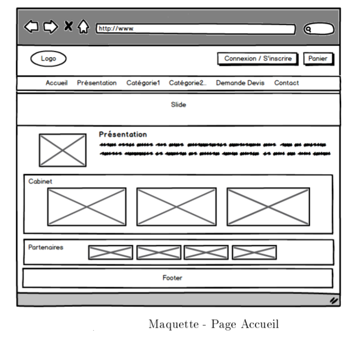
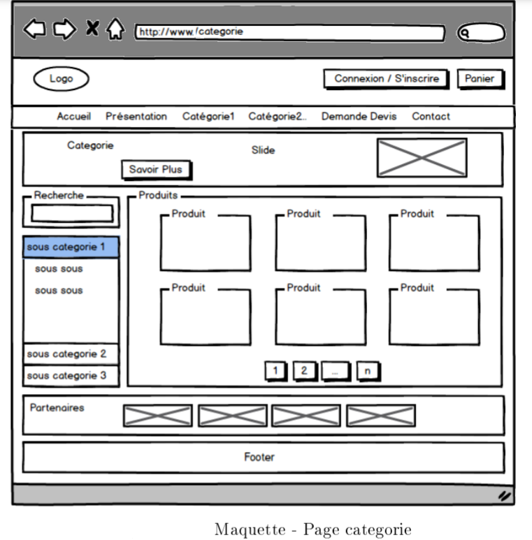
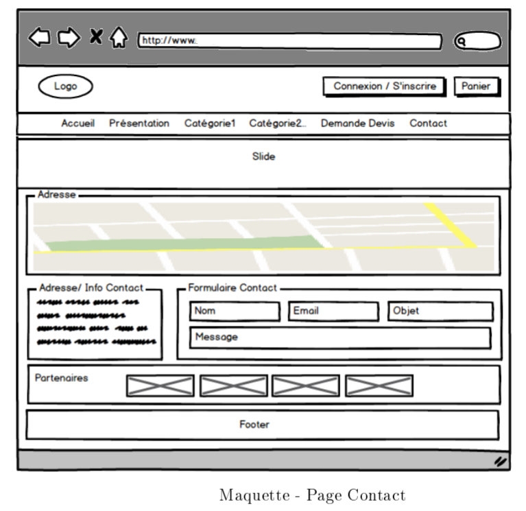

# Echamed
__Vente du matériel médical__

## Objectif

Le but de ce projet est de proposer une solution web pour l'entreprise Echamed afin de vendre les matériels médicals au Maroc.

## Problématique

Dans le cadre de la validation du projet de fin de formation 1 ère année, vous etes amené à réaliser une application web pour l'entreprise Echamed, spécialisée dans la vente et la distribution les matériels médicaux et équipenments Cliniques et Hôpitaux.

L'objectif d'Echamed est d'automatiser le système de vente d'une manière qui permet de cibler un grand nombre de clients au Maroc et d'augmenter le chiffre annuel des ventes, du coup la présentation des produits seront à travers une interface web et mobile qui permet de les lister selon leurs catégories et leurs types, mais elle offre également la possibilité de demande de devis et de contact par formulaire ou par Mail.

L'application inclut aussi un back-office : c'est un espace administrateur permettant la gestion de pages, de catégories et de produits, leurs disponibilités ainsi les clients.

## Uses Stories

### Au visiteur
- __Créer un compte__ : Un visiteur peut créer un compte.

### A l'internaute de :
- __Consulter les produits__ : Chaque produit présent sur le site sera présenté en détail sur sa propre page représentant sa fiche technique. On y trouvera en particulier une image que l'internaute pourra agrandir, une description du produit, son prix et sa disponibilité.

- __Chercher un produit__ : l'internaute a la possibilité de chercher un produit par son code ou son nom. La résultat du recherche sera disponible sur une page particulière.

- __Demande devis et contact__ : Chaque utilisateur de l'application doit accèder facilement à un formulaire permettant la demande d'un devis ou contacte la société.

- __Gérer panier__ : Lorsque l'internaute est intéressé par un produit, il peut l'enregistrer
dans un panier virtuel. Il doit pouvoir ensuite à tout moment ajouter, supprimer ou encore modifier les quantités avant de passer la commande. Le panier ne sera pas sauvegardé dans la base de données, sa durée de vie n'excèdera pas celle de la visite de l'utilisateur.

### Au client de :
- __Gérer ses commandes__ : À tout moment, le client doit pouvoir accéder au formulaire du bon de commande, dans lequel il saisit ses coordonnées et les informations nécessaires pour obtenir sa facture. Le client devra pouvoir ensuite suivre ses commandes récentes.

- __Gérer son compte__ : D'une manière générale, le client devra pouvoir gérer son compte, c'est-à-dire modifier ses coordonnées, ses préférences, son adresse, etc.

### Au responsable commercial de :
- __Gérer les catégories__ : Le responsable commercial a le droit de gérer les catégories.
- __Gérer les produits__ : Le responsable commercial a le droit de gérer les produits.

### A l'administrateur de :
- __Gérer le site__ : L'administrateur peut gérer le site dans la partie Backend
- __Consulter contact et demane devis__ : L'administrateur peut consulter et rependre au messages et demande devis et contact reçue.
- __Gérer les utilisateur__ : L'administrateur peut gérer les comptes des membres.
- __Gérer les partenaires__ : L'administrateur peut gérer les partenaires de la société.
- __Consulter les commandes__ : L'administrateur peut consulter et manipuler les commandes effectuées.

## Maquettes 
Les maquettes de notre application sont les suivantes : 

## Livrables demandés
- Diagramme de Gantt ou Kanban Board
- Diagramme de cas d'utilisation
- Diagrammes de séquences (Authentification pour visiteur, Gérer les produits par le commercial )
- Diagramme de classe (selon modèle MVC)
- Prototype de l'application (en respectant les maquettes)
- Lien Github contenant le code source de l'application

